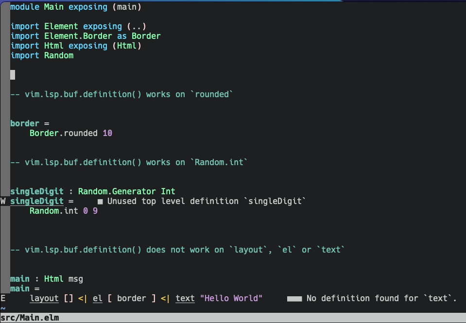
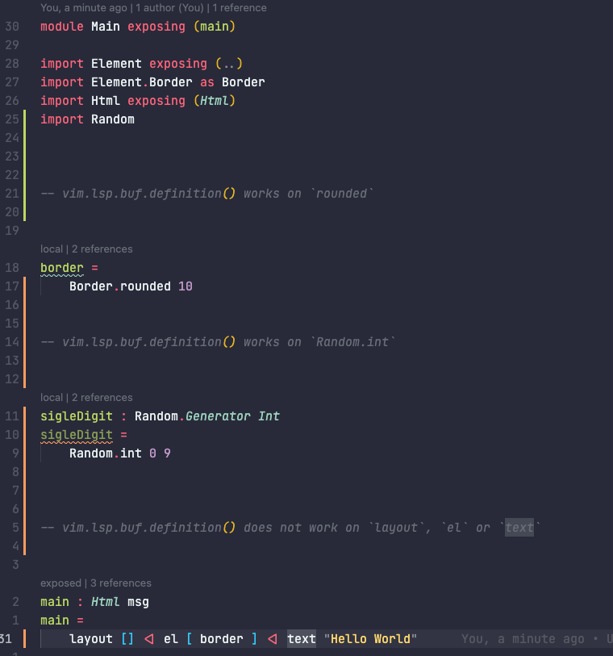

A small repository used to reproduce a lsp bug in neovim with [elm-language-server][elmls]

[elmls]: https://github.com/elm-tooling/elm-language-server

## steps to reproduce

1. install elm-language-server tools:
```sh
$ npm install -g @elm-tooling/elm-language-server elm-format elm-test

```
2. copy the provided minimal nvim config (be sure to **backup** yours before)
```sh
$ cp init.lua ~/.config/nvim
```
2. open `src/Main.elm` via `nvim` (using the minimal config)
```sh
$ nvim src/Main.elm
```

Notice that you can go to definition (`gd`) on `Border.rounded` and `Random.int`. But it does not work on any function exposed by `Element` such as : `layout`, `el` or `text`

This is how it looks in `nvim`:




This is the lsp.log output (when using `gd`):

```sh
[ DEBUG ] 2021-05-12T13:58:59-0700 ] ...neovim/HEAD-61aefaf_2/share/nvim/runtime/lua/vim/lsp.lua:894 ]  "LSP[elmls]"    "client.request"      1       "textDocument/definition"       {  position = {    character = 4,    line = 30  },  textDocument = {    uri = "file:///Users/aotarola/dev/elm-nvim/src/Main.elm"  }}  <function 1>    1
[ DEBUG ] 2021-05-12T13:58:59-0700 ] ...im/HEAD-61aefaf_2/share/nvim/runtime/lua/vim/lsp/rpc.lua:390 ]  "rpc.send.payload"   {  id = 2,  jsonrpc = "2.0",  method = "textDocument/definition",  params = {    position = {      character = 4,      line = 30    },    textDocument = {      uri = "file:///Users/aotarola/dev/elm-nvim/src/Main.elm"    }  }}
[ DEBUG ] 2021-05-12T13:58:59-0700 ] ...im/HEAD-61aefaf_2/share/nvim/runtime/lua/vim/lsp/rpc.lua:491 ]  "decoded"       {  jsonrpc = "2.0",  method = "window/logMessage",  params = {    message = "A definition was requested",    type = 3  }}
[ DEBUG ] 2021-05-12T13:58:59-0700 ] ...neovim/HEAD-61aefaf_2/share/nvim/runtime/lua/vim/lsp.lua:679 ]  "notification"  "window/logMessage"   {  message = "A definition was requested",  type = 3}
[ DEBUG ] 2021-05-12T13:58:59-0700 ] ...AD-61aefaf_2/share/nvim/runtime/lua/vim/lsp/handlers.lua:442 ]  "default_handler"    "window/logMessage"      {  client_id = 1,  params = {    message = "A definition was requested",    type = 3  }}
[ INFO ] 2021-05-12T13:58:59-0700 ] ...AD-61aefaf_2/share/nvim/runtime/lua/vim/lsp/handlers.lua:414 ]   "A definition was requested"
[ DEBUG ] 2021-05-12T13:58:59-0700 ] ...im/HEAD-61aefaf_2/share/nvim/runtime/lua/vim/lsp/rpc.lua:491 ]  "decoded"       {  id = 2,  jsonrpc = "2.0",  result = vim.NIL}
[ DEBUG ] 2021-05-12T13:58:59-0700 ] ...AD-61aefaf_2/share/nvim/runtime/lua/vim/lsp/handlers.lua:442 ]  "default_handler"    "textDocument/definition"        {  bufnr = 1,  client_id = 1}
[ INFO ] 2021-05-12T13:58:59-0700 ] ...AD-61aefaf_2/share/nvim/runtime/lua/vim/lsp/handlers.lua:294 ]   "textDocument/definition"     "No location found"
```

However, same version of `elm-language-server` works in `VSCode`


